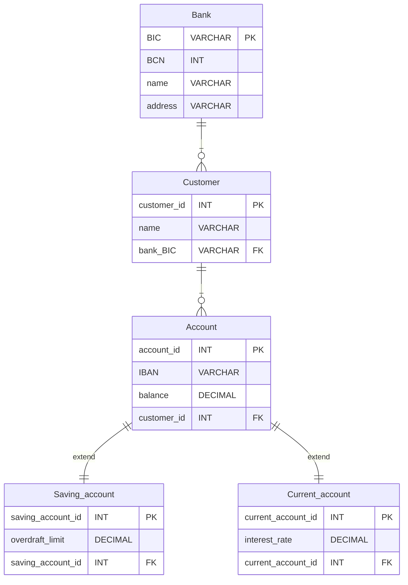

from app.py

```mermaid
    erDiagram
        Bank {
            BIC VARCHAR PK
            BCN INT
            name VARCHAR
            address VARCHAR
        }
        
        Customer {
            customer_id INT PK
            name VARCHAR
            bank_BIC VARCHAR FK
        }

        Account {
            account_id INT PK
            IBAN VARCHAR
            balance DECIMAL
            customer_id INT FK
        }

        Saving_account {
            saving_account_id INT PK
            overdraft_limit DECIMAL
            saving_account_id INT FK
        }

        Current_account {
            current_account_id INT PK
            interest_rate DECIMAL
            current_account_id INT FK
        }

        Bank ||--o{ Customer : _
        Customer ||--o{ Account : _
        Account ||--|| Saving_account : extend
        Account ||--|| Current_account : extend

```
